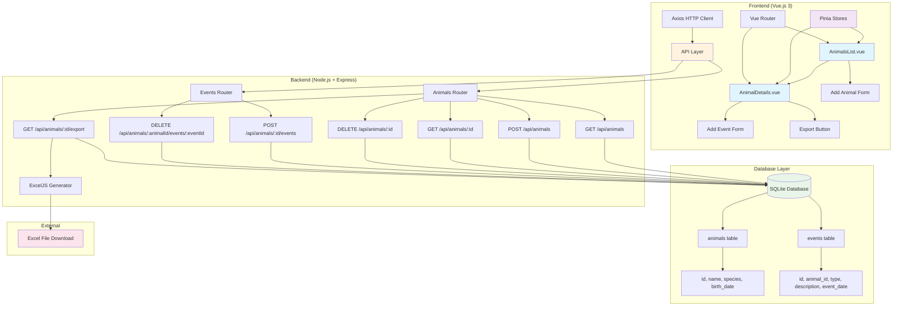

# 🐾 Veterinary Clinic Management System

A full-stack web application for veterinary clinics to manage animal patients and their medical records, built as a technical assessment project.

## 📋 Project Overview

This application provides a complete solution for veterinary clinics to:
- **Manage Animal Records** - Store and track animal information (name, species, birth date, age)
- **Record Medical Events** - Log visits, treatments, and observations for each animal
- **Generate Excel Reports** - Export detailed animal records with all associated events
- **Modern Interface** - Responsive Vue.js frontend with intuitive user experience

## 🏗️ Technical Architecture



### Frontend
- **Vue.js 3** with Composition API
- **Pinia** for state management
- **Vue Router** for navigation
- **Axios** for API communication
- **Vite** for build tooling
- **Responsive design** with modern CSS

### Backend
- **Node.js** with **Express.js** framework
- **SQLite** database (easily configurable for PostgreSQL/MySQL)
- **ExcelJS** for Excel file generation
- **RESTful API** design
- **CORS** enabled for frontend communication

### Database Schema
```sql
-- Animals table
CREATE TABLE animals (
  id INTEGER PRIMARY KEY AUTOINCREMENT,
  name TEXT NOT NULL,
  species TEXT NOT NULL,
  birth_date TEXT NOT NULL,
  created_at DATETIME DEFAULT CURRENT_TIMESTAMP
);

-- Events table
CREATE TABLE events (
  id INTEGER PRIMARY KEY AUTOINCREMENT,
  animal_id INTEGER NOT NULL,
  type TEXT NOT NULL CHECK (type IN ('Visit', 'Treatment', 'Observation')),
  description TEXT NOT NULL,
  event_date TEXT NOT NULL,
  created_at DATETIME DEFAULT CURRENT_TIMESTAMP,
  FOREIGN KEY (animal_id) REFERENCES animals(id) ON DELETE CASCADE
);
```

## 🚀 Getting Started

### Prerequisites
- **Node.js** (version 16 or newer)
- **npm** package manager

### Installation & Setup

1. **Clone the repository**:
   ```bash
   git clone <repository-url>
   cd travelfactory_home_assignment
   ```

2. **Install all dependencies**:
   ```bash
   npm run install-all
   ```

3. **Initialize the database**:
   ```bash
   cd server
   npm run init-db
   cd ..
   ```

4. **Start the application**:
   ```bash
   npm run dev
   ```

5. **Access the application**:
   - Frontend: `http://localhost:5173`
   - Backend API: `http://localhost:3001`

## 📚 API Endpoints

### Animals
- `GET /api/animals` - List all animals with age calculation
- `POST /api/animals` - Add a new animal
- `GET /api/animals/:id` - Get animal details with events
- `DELETE /api/animals/:id` - Delete an animal and its events

### Events
- `POST /api/animals/:id/events` - Add an event for an animal
- `DELETE /api/animals/:animalId/events/:eventId` - Delete a specific event
- `GET /api/events` - Get all events (optional)

### Export
- `GET /api/animals/:id/export` - Download Excel report for an animal

## 🎯 Features Implementation

### ✅ Completed Features
- **Animal Management**: Full CRUD operations for animals
- **Event Recording**: Add visits, treatments, and observations
- **Excel Export**: Generate detailed reports with animal info and events
- **Responsive Design**: Works on desktop and mobile devices
- **State Management**: Pinia stores for animals, theme, and notifications
- **Error Handling**: Comprehensive error handling and user feedback
- **Data Validation**: Server-side validation for all inputs

### 🔧 Technical Choices Made

1. **Database**: SQLite for simplicity (easily replaceable with PostgreSQL/MySQL)
2. **State Management**: Pinia for modern Vue.js state management
3. **Excel Generation**: ExcelJS for professional Excel file creation
4. **API Design**: RESTful endpoints following best practices
5. **Error Handling**: Consistent error responses and user notifications
6. **Code Structure**: Separation of concerns with dedicated routes and stores

## 📁 Project Structure

```
├── client/                 # Vue.js frontend
│   ├── src/
│   │   ├── components/     # Reusable components
│   │   ├── views/          # Page components
│   │   ├── stores/         # Pinia stores
│   │   └── router/         # Vue Router configuration
├── server/                 # Node.js backend
│   ├── routes/            # API route handlers
│   ├── config/            # Database configuration
│   └── scripts/           # Database initialization
├── data/                  # SQLite database file
└── package.json           # Root package configuration
```

## 🛠️ Development Commands

```bash
# Install all dependencies
npm run install-all

# Start development servers (both frontend and backend)
npm run dev

# Start only the backend server
npm run server

# Start only the frontend client
npm run client

# Build for production
npm run build

# Start production server
npm start
```

## 🧪 Testing the Application

1. **Add Animals**: Use the "Add Animal" button to create new animal records
2. **View Details**: Click on any animal to view its details and events
3. **Add Events**: Use the form to add visits, treatments, or observations
4. **Export Data**: Click "Export to Excel" to download a detailed report
5. **Delete Records**: Remove animals or individual events as needed

## 🔍 Known Limitations

- **Database**: Currently uses SQLite (can be easily migrated to PostgreSQL/MySQL)
- **Authentication**: No user authentication system implemented
- **Search**: No search/filter functionality for animals
- **File Uploads**: No image upload capability for animals
- **Validation**: Basic client-side validation (server-side validation is comprehensive)

## 🚀 Future Enhancements

- User authentication and authorization
- Advanced search and filtering
- Image uploads for animals
- Email notifications for appointments
- Mobile app development
- Real-time notifications
- Advanced reporting features

## 📞 Support

For technical issues or questions about the implementation, please refer to the code comments and API documentation within the project files.
